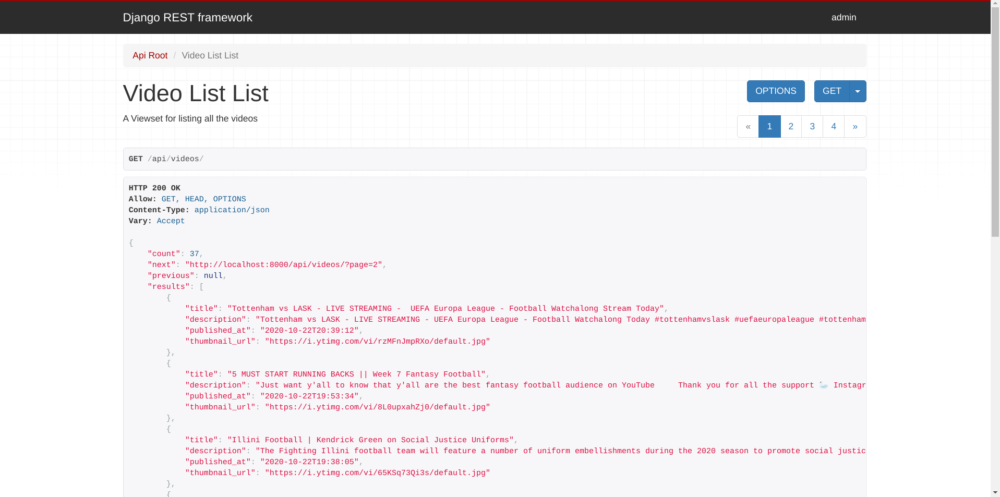

# Youtube Watchmen

## Overview
An app to get the latest videos on predefined search query. This app provides an API for the latest videos sorted in reverse chronological order of their publishing date-time from YouTube for a given tag/search query in a paginated response.

### Features
- Paginated API response
- Async YT Data fetch with the help of celery and redis
- API Key rotation in case of quota exhaustion
- UI to display all the videos

### Screenshots


### API endpoints
- `GET /api/videos/`  -
This endpoint returns a list of all videos in the database in a paginated resposne.

## Build Guide

### Create Virtual Environment
Create a virtual environment and activate it
```shell
python3 -m venv env
source env/bin/active
```
Now move inside the project folder
```shell
cd YoutubeWatchmen
```

### Install dependencies
Install python dependencies
```shell
pip install -r requirements.txt
```

For the async API fecth function to work, you need to install redis and start a celery worker. 
Steps to install redis are as follows:

1. For ubuntu server `sudo apt install redis-server`
2. `sudo nano /etc/redis/redis.conf`
3. Inside the file find the `supervised` directive and change it to `systemd`. It should be set to `no` by default.
  ```
    ...
    supervised systemd
    ...
  ```
4. `sudo systemctl restart redis.service`
5. Add `redis://localhost:6379` in the `CELERY_BROKER_URL` part of the `.env` file you have in your locally cloned repository.

To check if redis is working correctly or not:
1. Type in `redis-cli`
2. Type `ping`
3. If it returns `PONG`, then your redis-broker server is running fine.

### Configuration
This project uses `python-decouple` for dotenv files
```shell
cp .env.example .env
```
Then `.env` according to the needs

*For the ease of configuration, I have kept defaults in all configurations, so it will work even if you ignore this step*

### Run the app
Steps to follow to run the app
```shell
python manage.py migrate
python manage.py runserver
```

Open a another terminal, activate the virtual environment and start celery by 
```shell
celery -A YoutubeWatchmen worker -B -E -l INFO
```

### For Production uses
 - Nginx as reverse proxy
 - Gunicorn as WSGI server
 - PostgreSQL as DB
 - Services (gunicorn, celery, nginx) can be managed by systemctl units.
 - Multiple workers for can be used with celery for scaling
